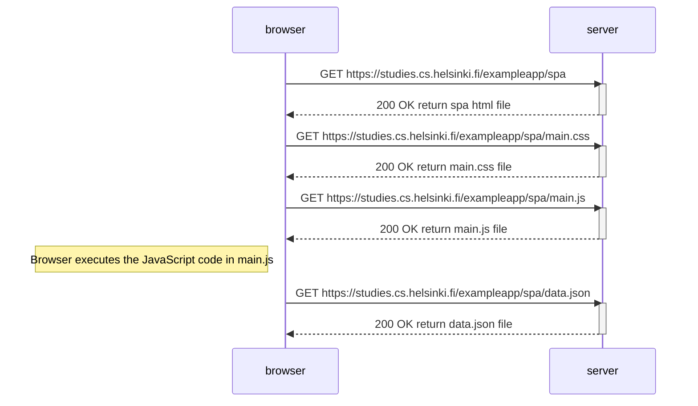

```mermaid
sequenceDiagram
    participant browser
    participant server

    browser->>server: GET https://studies.cs.helsinki.fi/exampleapp/spa
    activate server
    server-->>browser: 200 OK return spa html file
    deactivate server

    browser->>server: GET https://studies.cs.helsinki.fi/exampleapp/spa/main.css
    activate server
    server-->>browser: 200 OK return main.css file
    deactivate server

    browser->>server: GET https://studies.cs.helsinki.fi/exampleapp/spa/main.js
    activate server
    server-->>browser: 200 OK return main.js file
    deactivate server

    Note left of browser: Browser executes the JavaScript code in main.js

    browser->>server: GET https://studies.cs.helsinki.fi/exampleapp/spa/data.json
    activate server
    server-->>browser: 200 OK return data.json file
    deactivate server
```